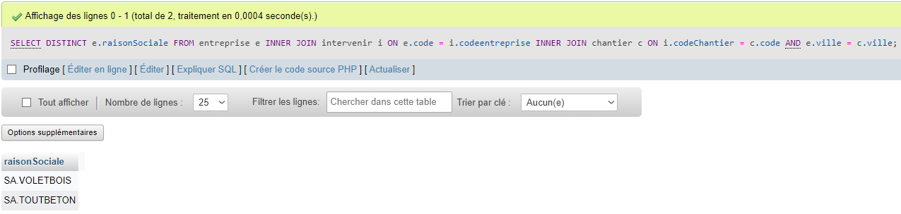

# TP MYSQL

On souhaite gérer les interventions de différentes entreprises sur des chantiers, ainsi que le nombre d’intervenants par entreprise pour chacune des périodes. 

### Le schéma conceptuel :
****


### Le schéma relationnel  :
***
```
ENTREPRISE (code, raisonSociale, ville)
	code : clé primaire de la relation ENTREPRISE
CHANTIER (code, dateDeb, dateFin, ville)
	code : clé primaire de la relation CHANTIER
INTERVENIR (codeEntreprise, codeChantier, dateJour, duree, nbrIntervenant)
	codeEntreprise, codeChantier, dateJour : clé primaire de la relation INTERVENIR
	codeEntreprise : clé étrangère provenant de la relation ENTREPRISE
	codeChantier : clé étrangère provenant de la relation CHANTIER
```
### Exercices : Exécuter les requêtes suivantes et expliquer les requêtes : 
***


Ces requêtes SQL créent une base de données appelée "CHANTIER" contenant trois tables: `entreprise`, `chantier` et `intervenir`.

La deuxième requête crée la table "ENTREPRISE" avec les colonnes `code`, `raisonSociale` et `ville`. La colonne `code` est une clé primaire (PRIMARY KEY) qui ne peut pas être nulle (NOT NULL).

La table `entreprise` contient des informations sur les entreprises qui travaillent sur les chantiers, telles que le code de l'entreprise, le nom de la société et la ville où elle se trouve.

La cinquième requête crée la table "CHANTIER" avec les colonnes `code`, `dateDeb`, `dateFin` et `ville`. La colonne `code` est une clé primaire (PRIMARY KEY) qui ne peut pas être nulle (NOT NULL).

La table `chantier` contient des informations sur chaque chantier, telles que le code du chantier, les dates de début et de fin et la ville où il a lieu.

La neuvième requête crée la table "INTERVENIR" avec les colonnes `codeEntreprise`, `codeChantier`, `dateJour`, `duree` et `nbIntervenant`. La clé primaire (PRIMARY KEY) de cette table est une combinaison des trois premières colonnes (codeEntreprise, codeChantier et dateJour). Les colonnes `codeEntreprise` et `codeChantier` sont des clés étrangères (FOREIGN KEY) qui référencent respectivement les colonnes `code` de la table "ENTREPRISE" et `code` de la table "CHANTIER".

La table `intervenir` est une table de liaison qui relie les tables `entreprise` et `chantier`. Elle contient des informations sur les interventions de chaque entreprise sur chaque chantier, telles que la date de l'intervention, la durée et le nombre d'intervenants.

Les requêtes d'INSERT insèrent des données dans les tables `entreprise`, `chantier` et `intervenir`, tandis que les contraintes définissent les clés primaires et étrangères pour assurer l'intégrité des données dans la base de données.

***
### Exercices : Faire les requêtes pour répondre aux besoins suivants :
***

>Nombre d’entreprise qui ont effectués des chantiers.

```
SELECT COUNT(DISTINCT codeentreprise) FROM intervenir;
```


>Nombre d’interventions sur tous les chantiers réunis.

```
SELECT SUM(nbIntervenant) FROM intervenir;
```


>Liste (code, dateDeb, dateFin) des chantiers qui ont employés de plus de 28 intervenants

```
SELECT code, dateDeb, dateFin
FROM chantier
WHERE code IN (SELECT codeChantier FROM intervenir GROUP BY codeChantier HAVING SUM(nbIntervenant) > 28);
```


>Pour chacune des entreprises (Raison Sociale), afficher le nombre de jour d’intervention pour le chantier A. Les entreprises qui ne sont pas intervenues devront apparaitre. 
```
SELECT e.raisonSociale, COALESCE(SUM(i.duree), 0) as nbJoursIntervention
FROM entreprise e
LEFT JOIN intervenir i ON e.code = i.codeentreprise AND i.codeChantier = 'A'
GROUP BY e.raisonSociale;
```


>Sachant d’une journée homme coute en moyenne 150€, quel est le coût, pour chacun des chantiers concernant la main d’œuvre.
```
SELECT c.code, SUM(i.duree * i.nbIntervenant * 150) as coutMainOeuvre
FROM chantier c
LEFT JOIN intervenir i ON c.code = i.codeChantier
GROUP BY c.code;
```


>Nombre de jour travaillé pour chacune des entreprises.
```
SELECT e.raisonSociale, SUM(i.duree) as nbJoursTravailles
FROM entreprise e
LEFT JOIN intervenir i ON e.code = i.codeentreprise
GROUP BY e.raisonSociale;
```


>Liste des entreprises qui ont travaillés sur des chantiers dans leur ville
```
SELECT DISTINCT e.raisonSociale
FROM entreprise e
INNER JOIN intervenir i ON e.code = i.codeentreprise
INNER JOIN chantier c ON i.codeChantier = c.code AND e.ville = c.ville;
```



>Supprimer les entreprises qui se trouvent à Nantes
```
DELETE FROM entreprise WHERE ville = 'Nantes';
```


Ceci est un piège, le message indique que je ne peux pas supprimer ou mettre à jour la ligne 'entreprise' parceque c'est une clé étrangère, je dois supprimer le lien ou mettre à jour les lignes liées a cette clé.

Comment je règle personnellement ce problème : 

Je regarde le code de l'entreprise en question (2):

je supprime toutes les lignes liées à l'entreprise dans la table intervenir : 
```
DELETE FROM intervenir WHERE codeEntreprise = 2;
```


ensuite dans la table entreprise : 

```
DELETE FROM entreprise WHERE code = 2;
```
#� �C�Y�G�A�N�_�T�H�E�O�_�B�D�D�_�I�n�t�r�o�d�u�c�t�i�o�n�
�
�
